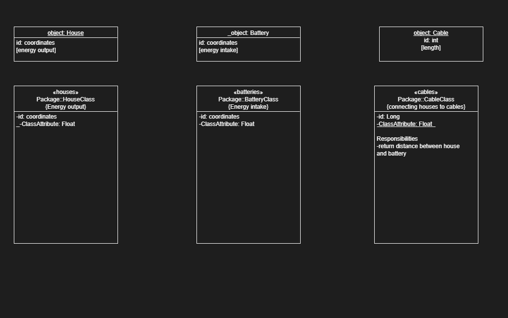

# Groep 3min1
Smart Grid Minor Programmeren

## Paulien Tideman en Charif Ghammane

Stappenplan:
***UML AANPASSEN***

1. load houses and batteries
1.5 cables momenteel lege list...
1.9 simpel algoritme
2. functies bouwen voor house en battery
3. algorithm (deels) toevoegen aan algorithm folder
4. output testen in main.py 

# eerst abstract bijhhouden in een datastructuur
# kabels later relevant maken 
