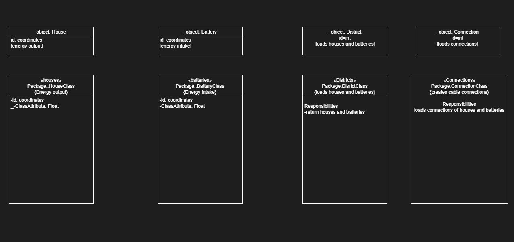

# Team 3min1
Smart Grid

## Paulien Tideman & Charif Ghammane

To run the program select via command-line which district you would like to get a solution for. 
After selecting the district please select which algorithm you would like to use.

Smart Grid focusses on three districts that exists out of batteries and houses. 
The goal of this case was to connect as much houses as possible to batteries within the shortest distance without exceeding battery capacity.
Connecting the houses is done through cables which are calculated by their length therefore all the results are the total cable length. 

We tried this proces through the following algorithms:

    - random, this algorithm randomly connected houses to batteries.

    -hillclimber, which uses the random algorithm's connections and improves on those by switching connections untill it gets better results.

    - depthfirstcombis, which is a depth first search that first starts by pruning to decrease the state-space and then makes connections based on combinations of houses and batteries. 

Repository contains following files:

- Code: folder contains all the algorithms classes and visulasation code.

- Algorithms: folder contains the used algorithms

*the experimental folder contains algorithms that have a strong logical foundation but did not produce valid results* 

*not_for_grading folder contains algorithms which should not be graded* 

- Classes: folder contains all the classes we have used.

- Visualastion: folder contains all code for visualisations.

- Data: folder contains all data for districts to be implemented.

- Docs: folder contains json output file.

- Images: folder contains all images used in Readme.

- Uml's: folder contains uml file used in Readme.

- Visuals: folder contains all visual data and graphs.
